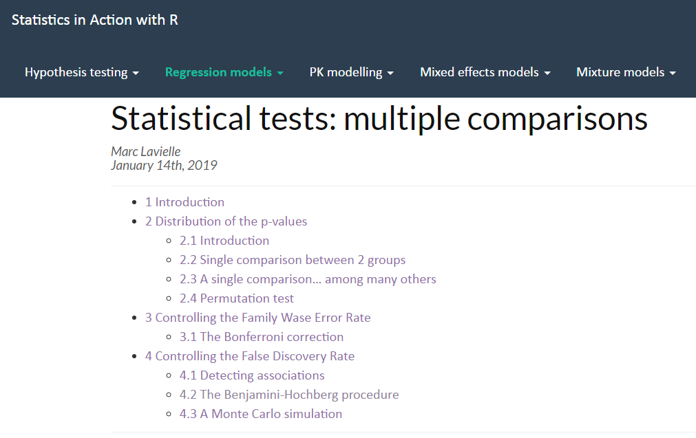

<!-- edit name1 and name2 in the YAML above -->

```{r setup, include=FALSE}
options(htmltools.dir.version = FALSE)
knitr::opts_chunk$set(warning = FALSE, message = FALSE)
```
```{r packages, include=FALSE}
require(devtools)
if(!require(installifnot)) install_github("uebvhir/installifnot")

installifnot("XML")
installifnot("GGally")
installifnot("readxl")
installifnot("kableExtra")
installifnot("webshot")
```

<style type="text/css">
.remark-slide-content {
    font-size: 30px;
    padding: 1em 4em 1em 4em;
}
</style>

# Statistics and Bioinformatics Unit (UEB)

```{r echo=FALSE, out.width="100%", fig.align='center'}
knitr::include_graphics("images/uebvhir.png")
```

.center[
.font150[
[http://ueb.vhir.org](http://ueb.vhir.org)
]
]
---

# Outline of the talk

- Why this pill. Motivation & Cases
- From Type I errors to Multiple Error Rates
- Strategies for Multiple Testing Adjustments
- Multiple testing adjustment in practice
- Variations on a theme
- Should we correct or not? When?
- Recomendations (guidelines)
- Summary


---
# When multiplicity is ignored ...

(Bad management) of multiplicity can yield potentially spurious results

```{r echo=FALSE, out.width="90%", fig.align='center'}
knitr::include_graphics("images/multiplicityComic1.png")
```

http://xkcd.com/882/

---

# When multiplicity is ignored ...

```{r echo=FALSE, out.width="90%", fig.align='center'}
knitr::include_graphics("images/multiplicityComic1b.png")
```
---

# When multiplicity is ignored ...

```{r echo=FALSE, out.width="90%", fig.align='center'}
knitr::include_graphics("images/multiplicityComic1c.png")
```
---

# When multiplicity is ignored ...

```{r echo=FALSE, out.width="90%", fig.align='center'}
knitr::include_graphics("images/multiplicityComic1d.png")
```
---

# When multiplicity is ignored ...

```{r echo=FALSE, out.width="90%", fig.align='center'}
knitr::include_graphics("images/multiplicityComic1e.png")
```
---


# When multiplicity is ignored ...

```{r echo=FALSE, out.width="50%", fig.align='center'}
knitr::include_graphics("images/multiplicityComic3.png")
```
---
# But, what is multiplicity?

- The __multiple comparisons__, __multiplicity__ or __multiple testing__ problem occurs when one considers a set of statistical inferences simultaneously ... 

- The more inferences are made, the more likely erroneous inferences are to occur.

- Multiplicity appears in many distinct situations

---

# Example: __*Multiple outcomes*__

### Frantic paresis association with distinct outcomes

```{r echo=FALSE, out.width="100%", fig.align='center'}
knitr::include_graphics("images/multiplicityExamples1MultipleOutcomes.png")
```
---

# Example: __*Several groups*__

### Raw p-values of post-Hoc (after ANOVA) pairwise comparisons

<br>

|  | B | C | D |  |
|---|-------|-------|-------|---|
|__A__ | 0.045 | 0.098 | 0.062 |  |
|__B__ |  | 0.683 | 0.891 |  |
|__C__ |  |  | 0.638 |  |

---

# Example: __*Omics data*__

### A simple microarray analysis yields tables with thousands of test results

```{r echo=FALSE, out.width="100%", fig.align='center'}
knitr::include_graphics("images/multiplicityExamples3Microarrays.png")
```
---


# Hypothesis Testing Refresher

- Most situations desbribed above can be described or related with a __test of hypothesis__.
- Tests use to be summarized with __p-values__. <br>
- __p-value__ : Probability, assuming no effect $(H_0)$, to obtain a difference greater or equal than the one observed on a given sample. <br>
- Standard criterion: "reject $H_0$ if $p \geq \alpha$".
     
---

# Decision table and error types

- When decisions are made, based on data, one can take right or wrong decisions
- Wrong decisions: __type I__ or __type II errors__.


```{r echo=FALSE, out.width="100%", fig.align='center'}
knitr::include_graphics("images/decisionTable1.png")
```

---

# Controlling (type I) Errors

- A test is said to _control type I error_ if the probability of wrongly rejecting $H_0$ is smaller than the significance level of the test.
.font80[
$$
    P[\mbox{Reject} \, H_0 | H_0 \, \mbox{true}]=P[FP] \leq \alpha
$$
]
- This does not guarantee anything on the power of the test.

    + A test can control type I error while having small power


---

# From 1 to $>1$ hypotheses

- As more hypothesis are tested simultaneously, 
the probability of wrongly rejecting __at least one true null__ increases:

.font80[

- P(Making 1 error) = $\alpha$
    
- P(__Not__ Making 1 error) = $1-\alpha$
    
- P(__Not__ Making 1 error in 2 tests) = $(1-\alpha)^2$
  
- 3, 4, ..., m tests
    
- P(__Not__ Making 1 error in $m$ tests) = $(1-\alpha)^m$
    
- P(Making __at least__ 1 error in $m$ tests) = $1-(1-\alpha)^m$
]
---

# From 1 to $>1$ hypotheses


.pull-left[
```{r echo=FALSE}
k <- c(1,2,4, 8, 12, 100, 1000)
probAtLeast1 <- round(1 - 0.95^k,5)
expectedNum <- k * 0.05
kableExtra::kable(data.frame(m=k,Prob= probAtLeast1))
```
]
.pull-right[
```{r, echo=FALSE}
k <- 1:1000
probs <- round(1 - 0.95^k,4)
plot(probs~ k, main="Probability of at least 1 FP", cex.main=0.9, xlab= "m", ylab="Prob")
```
]
---

# Implications for our examples

- If we test multiple hypothesis simultaneously the overall type I error probability is not controlled anymore.

- Testing 12 tests simultaneosly yields almost a 50% chance of  a statistically significant result  __even if none of the hypothesis tested is false __

- How do we incorporate the impact of multiple testing on our inference?

---

# A simulated example (1)

- We simulated an omics study with 6000 genes whose expression has been measured on 8 cases and 8 controls, and where __no gene shows real difference between them__.

- What happens if we call _differentially expressed_ any gene with $p < 0.05$

- The number of genes falsely rejected will be on average of $6000 \times \alpha$.
    
---

# We start with no differences ...

```{r echo=FALSE, out.width="120%", fig.align='center'}
knitr::include_graphics("images/simulatedArray1.png")
```
---

# As more genes are checked ...

```{r echo=FALSE, out.width="110%", fig.align='center'}
knitr::include_graphics("images/simulatedArray2.png")
```
---

# All together, sorted by p-values

```{r echo=FALSE, out.width="110%", fig.align='center'}
knitr::include_graphics("images/simulatedArray3.png")
```
---

# So what can be done?

- Intuitive idea: Doing many tests increases the chances of calling false positives,

- This may be compensated 
    + Using _more restrictive error rates_, for instance 0.01 or 0.005 instead of 0.05.
    
    + Adjusting ("correcting") the p-values to compensate for the number of tests.
    
---

# Distinct Error Rates

- Individual error rate (IER)
    + Error rate of a single test.
    + For a test with 5% significance level the IER is 0.05
    
- Global Error Rate
    + Error rate for one or several groups of tests. 
    + For a group of tests each with 5% significance the global error rate is > 5%

---

<!-- # Extending type I error control -->

<!-- - With more than 1 test rejecting hypotheses with a p-value less than $\alpha$ doesn’t control for $P[FD]$ anymore. -->
<!-- - What can be done? -->
<!--      + Extend the idea of type I error -->
<!--           - FWER and FDR are two such extensions -->

<!--      + Look for procedures that control the probability for these extended error types -->
<!--           - Mainly adjust raw p-values -->

<!-- --- -->


# Decision table for many tests

- With many tests we count discoveries 

```{r echo=FALSE, out.width="100%", fig.align='center'}
knitr::include_graphics("images/decisionTable2.png")
```

---

# Two main error rate extensions

- Family Wise Error Rate (FWER) 
    + FWER is probability of at least 1 False Discovery
    + FWER = P (FD > 0) 
   
- False Discovery Rate (FDR)
    + FDR is expected value of proportion of False Discoveries among all Discoveries .
    + FDR = E (FD/D; D>0)
---

# FWER / FDR control procedures

- FWER 
    + Bonferroni
    + Holm (1979)
    + Hochberg (1986)

- FDR
    + Benjamini & Hochberg (1995)
    + Benjamini & Yekutieli (2001)
---

# Controlling the FWER (Bonferroni)

- Bonferroni procedure: Adjust significance level for number of tests performed (m)

  + Use significance level $\alpha/m$, 

- Equivalently, adjust p-values multiplying all p-values by m.

- Other, more efficient procedures available: See a statistician

---

# Example. Presenting data.

.pull-left[
.font70[

- García-Arenzana et al. (2014) tested associations of 25 dietary variables with mammographic density, an important risk factor for breast cancer, in Spanish women.
- They found the following results (only first 10 are shown)
]
]
.pull-right[
```{r echo=FALSE, out.width="100%", fig.align='center'}
knitr::include_graphics("images/dietExample1.png")
```
]

[See complete example](http://www.biostathandbook.com/multiplecomparisons.html)

---

# Example. Bonferroni (FWER)

```{r echo=FALSE, out.width="100%", fig.align='center'}
knitr::include_graphics("images/dietExample2.png")
```
---


# Controlling the FDR (B & H)

- Benjamini-Hochberg procedure: Provides control of FDR for a fixed FDR value 
    + 5% FDR: On average, 5% of your significant findings will be false
    
- Important: FDR is not an individual error rate.
    + A number higher than 0.05, such as 0.10 or 0.25 can be used

---

# Benjamini & Hochberg
    
- Procedure is relatively simple
    + Order the p-values
    + To provide control at a $Q$ FDR value compare i-th smallest p-value to  $i \times Q/m$

- Instead of setting the FDR at a fixed value and establishing significance/non significance an, __adjusted p-value__ may be computed.

---

# Example. B-H (FDR)

```{r echo=FALSE, out.width="100%", fig.align='center'}
knitr::include_graphics("images/dietExample3.png")
```
---

# Example: Adjustments with R

```{r echo=FALSE, out.width="100%", fig.align='center'}

```
---

# What error rate to control for

- FWER Controls for no (0) false positives
     + Rejects many fewer hypothese (less false positives),
     + but you are likely to miss many.
     + Adequate if goal is to identify few cases that differ between two groups.
     
---

# What error rate to control for

- FDR Controls the (expected) proportion of false positives
    + if you can tolerate more false positives
    + you will get many fewer false negatives
    + Adequate if goal is to pursue the study e.g. to determine functional relationships among genes

---
# Should we adjust for MT?

- This a controversial issue.

- Many authors are in favour

.font70[
+ Moyé:“ _Type I error accumulates with each executed hypothesis test and must be controlled by the investigators_”
    
+ Blakesley et al. : “ _Failure to control type I errors when examining multiple outcomes may yield false inferences, which may slow or sidetrack research progress_”

]
---
# Or shouldn't we?

- Rothman: "No adjustments are needed for multiple comparisons"

.font70[

+ _Reducing the type I error for null associations increases the type II error for those associations that are not null_
    
+ _A policy of not making adjustments for multiple comparisons is preferable because it will lead to fewer errors of interpretation when the data under evaluation are not random numbers but actual observations on nature_.
    
+ _Scientists should not be so reluctant to explore leads that may turn out to be wrong that they penalize themselves by missing possibly important findings_. 
]

---

# Summary: Basic principles

1. The multiple comparisons problem (MCP) __should not be ignored__.

2. __Limiting the number of outcomes and subgroups__ is one of the best ways to address the MCP.

3. The MCP should be addressed by __first structuring the data__. <br>
Furthermore, protocols for addressing the MCP __should be made before data analysis is undertaken__.

---

# Developing a Strategy for MT

1. Delineate separate outcome domains in the study protocols.
2. Define confirmatory and exploratory analysis components prior to data analysis.
3. As a general rule consider adjusting for multiple testing in confirmatory analysis.
4. As a general rule exploratory analysis does not require adjusting for multiple testing.
5. Specify which subgroups will be part of the confirmatory analysis and which ones will be part of the exploratory analysis.

---

# Developing a Strategy (II)

<ol start="6">
<li> Apply multiplicity adjustments in experimental designs with multiple treatment groups.</li>
<li> Design the study to have sufficient statistical power for examining intervention effects for all prespecified confirmatory analyses.</li>
<li> Qualify confirmatory and exploratory analysis findings in the study reports.
</li>
</ol>
---

# References

.font40[

1. Blakesley RE, Mazumdar S, Dew MA, et al. Comparisons of Methods for Multiple Hypothesis Testing in Neuropsychological Research. Neuropsychology. 2009;23(2):255-264. doi:10.1037/a0012850
2. Moyé LA. P-value interpretation and alpha allocation in clinical trials. Ann Epidemiol. 1998;8(6):351-357. doi:10.1016/s1047-2797(98)00003-9
3. Rothman KJ. No adjustments are needed for multiple comparisons. Epidemiology. 1990;1(1):43-46. doi:10.1097/00001648-199001000-00010
4. Streiner DL. Best (but oft-forgotten) practices: The multiple problems of multiplicity-whether and how to correct for many statistical tests. Am J Clin Nutr. 2015;102(4):721-728. doi:10.3945/ajcn.115.113548
5. View of Planned Hypothesis Tests Are Not Necessarily Exempt From Multiplicity Adjustment | Journal of Research Practice. http://jrp.icaap.org/index.php/jrp/article/view/514/417. Accessed November 25, 2019.
6. Asante I, Pei H, Zhou E, et al. Exploratory metabolomic study to identify blood-based biomarkers as a potential screen for colorectal cancer. Mol Omi. 2019;15(1):21-29. doi:10.1039/c8mo00158h
7. Matsui S. Confirmatory and Exploratory Analyses in Omics Studies with Particular Focus on Multiple Testing and &lt;i&gt;P&lt;/i&gt;-value. Japanese J Biometrics. 2018;38(2):127-139. doi:10.5691/jjb.38.127
8. Kimmelman J, Mogil JS, Dirnagl U. Distinguishing between Exploratory and Confirmatory Preclinical Research Will Improve Translation. PLoS Biol. 2014;12(5). doi:10.1371/journal.pbio.1001863
9. Sethuraman A, Gonzalez NM, Grenier CE, et al. Continued misuse of multiple testing correction methods in population genetics‐A wake‐up call? Mol Ecol Resour. 2019;19(1):23-26. doi:10.1111/1755-0998.12969
10. Benjamini Y, Yekutieli D. The control of the false discovery rate in multiple testing under dependency. Ann Stat. 2001;29(4):1165-1188. doi:10.1214/aos/1013699998
11. Benjamini Y, Hochberg Y. Controlling the False Discovery Rate: A Practical and Powerful Approach to Multiple Testing. J R Stat Soc Ser B. 1995;57(1):289-300. doi:10.1111/j.2517-6161.1995.tb02031.x
12. Hauser S, Wakeland K, Leberg P. Inconsistent use of multiple comparison corrections in studies of population genetic structure: Are some type I errors more tolerable than others? Mol Ecol Resour. 2019;19(1):144-148. doi:10.1111/1755-0998.12947
13. 10 Things to Know About Multiple Comparisons | Egap. https://egap.org/methods-guides/10-things-you-need-know-about-multiple-comparisons. Accessed November 9, 2019.
14. Konishi T. Microarray test results should not be compensated for multiplicity of gene contents. BMC Syst Biol. 2011;5(Suppl 2):S6. doi:10.1186/1752-0509-5-S2-S6

]
---

# QUESTIONS?

```{r echo=FALSE, out.width="90%", fig.align='center'}

```


```{r, warning = FALSE, comment = NA, message = FALSE, echo = FALSE, eval = FALSE}
# HTML to PDF
library(webshot)
file_name <- paste0("file://", normalizePath("Multiple_Testing.html"))
webshot(file_name, "Multiple_Testing.pdf")
```

