<!-- edit name1 and name2 in the YAML above -->

```{r setup, include=FALSE}
options(htmltools.dir.version = FALSE)
knitr::opts_chunk$set(warning = FALSE, message = FALSE)
```
```{r packages, include=FALSE}
require(devtools)
if(!require(installifnot)) install_github("uebvhir/installifnot")

installifnot("XML")
installifnot("GGally")
installifnot("readxl")
installifnot("kableExtra")
installifnot("webshot")
```

<style type="text/css">
.remark-slide-content {
    font-size: 30px;
    padding: 1em 4em 1em 4em;
}
</style>

# Statistics and Bioinformatics Unit (UEB)

```{r echo=FALSE, out.width="100%", fig.align='center'}

```

.center[
.font150[
[http://ueb.vhir.org](http://ueb.vhir.org)
]
]
---

# Outline of the talk

- Why this pill. Motivation & Cases
- From Type I errors to Multiple Error Rates
- Strategies for Multiple Testing Adjustments
- Multiple testing adjustment in practice
- Variations on a theme
- Should we correct or not? When?
- Recomendations (guidelines)
- Summary


---
# When multiplicity is ignored ...

(Bad management) of multiplicity can yield potentially spurious results

```{r echo=FALSE, out.width="90%", fig.align='center'}
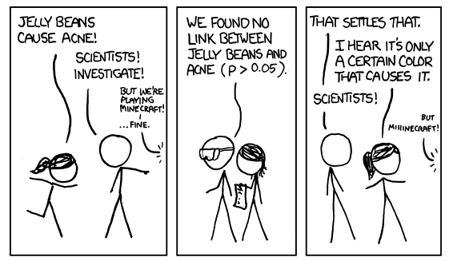
```

http://xkcd.com/882/

---

# When multiplicity is ignored ...

```{r echo=FALSE, out.width="90%", fig.align='center'}

```
---

# When multiplicity is ignored ...

```{r echo=FALSE, out.width="90%", fig.align='center'}
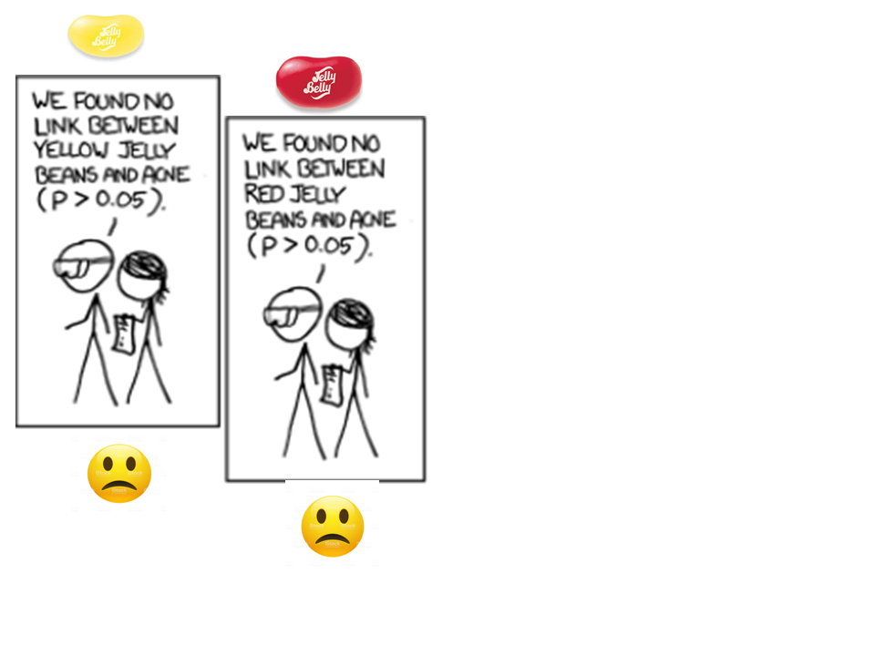
```
---

# When multiplicity is ignored ...

```{r echo=FALSE, out.width="90%", fig.align='center'}
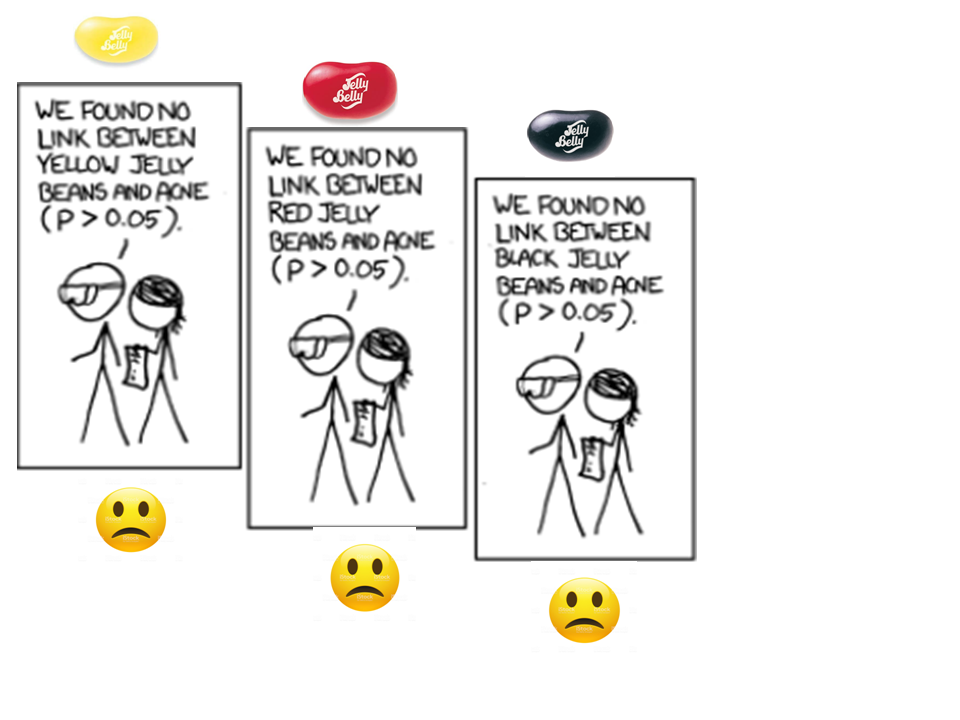
```
---

# When multiplicity is ignored ...

```{r echo=FALSE, out.width="90%", fig.align='center'}
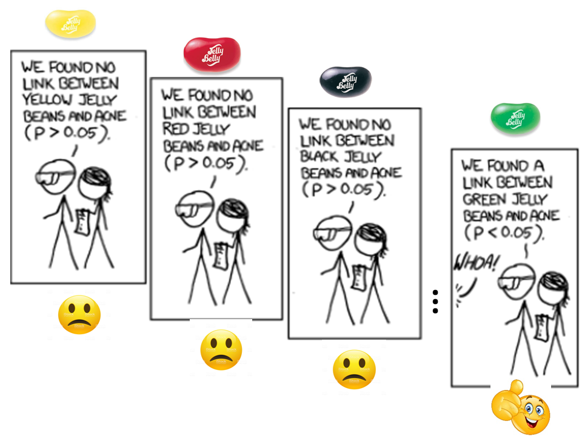
```
---


# When multiplicity is ignored ...

```{r echo=FALSE, out.width="50%", fig.align='center'}
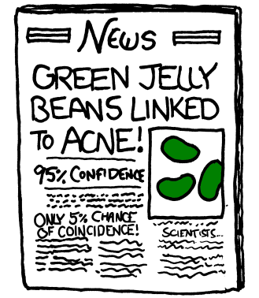
```
---
# But, what is multiplicity?

- The __multiple comparisons__, __multiplicity__ or __multiple testing__ problem occurs when one considers a set of statistical inferences simultaneously ... 

- The more inferences are made, the more likely erroneous inferences are to occur.

- Multiplicity appears in many distinct situations

---

# Example: __*Multiple outcomes*__

### Frantic paresis association with distinct outcomes

```{r echo=FALSE, out.width="100%", fig.align='center'}
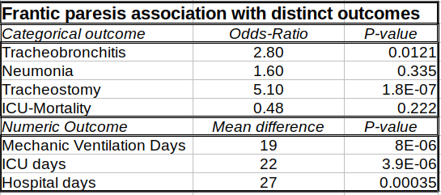
```
---

# Example: __*Several groups*__

### Raw p-values of post-Hoc (after ANOVA) pairwise comparisons

<br>

|  | B | C | D |  |
|---|-------|-------|-------|---|
|__A__ | 0.045 | 0.098 | 0.062 |  |
|__B__ |  | 0.683 | 0.891 |  |
|__C__ |  |  | 0.638 |  |

---

# Example: __*Omics data*__

### A simple microarray analysis yields tables with thousands of test results

```{r echo=FALSE, out.width="100%", fig.align='center'}
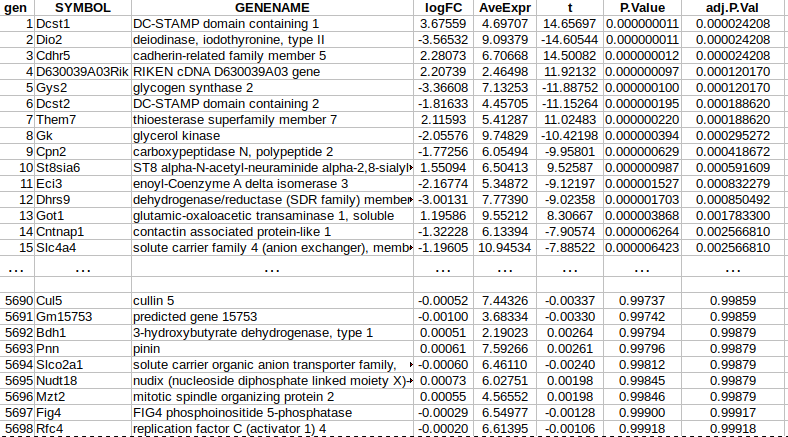
```
---


# Hypothesis Testing Refresher

- Most situations desbribed above can be described or related with a __test of hypothesis__.
- Tests use to be summarized with __p-values__. <br>
- __p-value__ : Probability, assuming no effect $(H_0)$, to obtain a difference greater or equal than the one observed on a given sample. <br>
- Standard criterion: "reject $H_0$ if $p \geq \alpha$".
     
---

# Decision table and error types

- When decisions are made, based on data, one can take right or wrong decisions
- Wrong decisions: __type I__ or __type II errors__.


```{r echo=FALSE, out.width="100%", fig.align='center'}
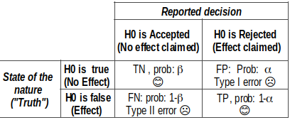
```

---

# Controlling (type I) Errors

- A test is said to _control type I error_ if the probability of wrongly rejecting $H_0$ is smaller than the significance level of the test.
.font80[
$$
    P[\mbox{Reject} \, H_0 | H_0 \, \mbox{true}]=P[FP] \leq \alpha
$$
]
- This does not guarantee anything on the power of the test.

    + A test can control type I error while having small power


---

# From 1 to $>1$ hypotheses

- As more hypothesis are tested simultaneously, 
the probability of wrongly rejecting __at least one true null__ increases:

.font80[

- P(Making 1 error) = $\alpha$
    
- P(__Not__ Making 1 error) = $1-\alpha$
    
- P(__Not__ Making 1 error in 2 tests) = $(1-\alpha)^2$
  
- 3, 4, ..., m tests
    
- P(__Not__ Making 1 error in $m$ tests) = $(1-\alpha)^m$
    
- P(Making __at least__ 1 error in $m$ tests) = $1-(1-\alpha)^m$
]
---

# From 1 to $>1$ hypotheses


.pull-left[
```{r echo=FALSE}
k <- c(1,2,4, 8, 12, 100, 1000)
probAtLeast1 <- round(1 - 0.95^k,5)
expectedNum <- k * 0.05
kableExtra::kable(data.frame(m=k,Prob= probAtLeast1))
```
]
.pull-right[
```{r, echo=FALSE}
k <- 1:1000
probs <- round(1 - 0.95^k,4)
plot(probs~ k, main="Probability of at least 1 FP", cex.main=0.9, xlab= "m", ylab="Prob")
```
]
---

# Implications for our examples

- If we test multiple hypothesis simultaneously the overall type I error probability is not controlled anymore.

- Testing 12 tests simultaneosly yields almost a 50% chance of  a statistically significant result  __even if none of the hypothesis tested is false __

- How do we incorporate the impact of multiple testing on our inference?

---

# A simulated example (1)

- We simulated an omics study with 6000 genes whose expression has been measured on 8 cases and 8 controls, and where __no gene shows real difference between them__.

- What happens if we call _differentially expressed_ any gene with $p < 0.05$

- The number of genes falsely rejected will be on average of $6000 \times \alpha$.
    
---

# We start with no differences ...

```{r echo=FALSE, out.width="120%", fig.align='center'}
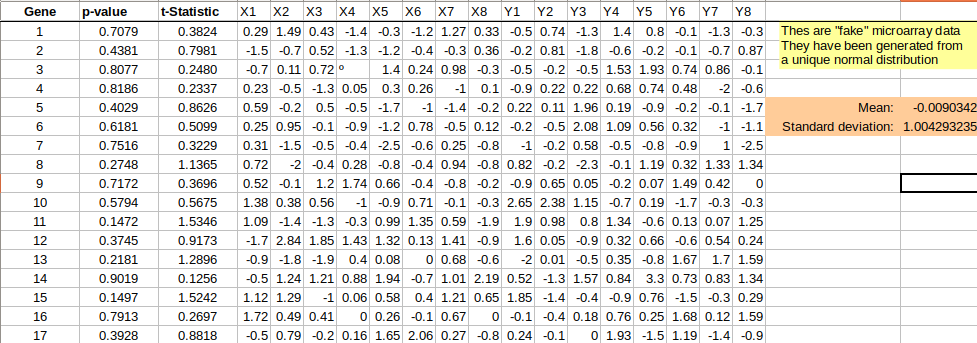
```
---

# As more genes are checked ...

```{r echo=FALSE, out.width="110%", fig.align='center'}
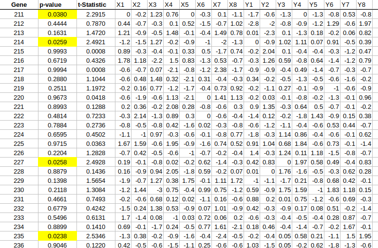
```
---

# All together, sorted by p-values

```{r echo=FALSE, out.width="110%", fig.align='center'}
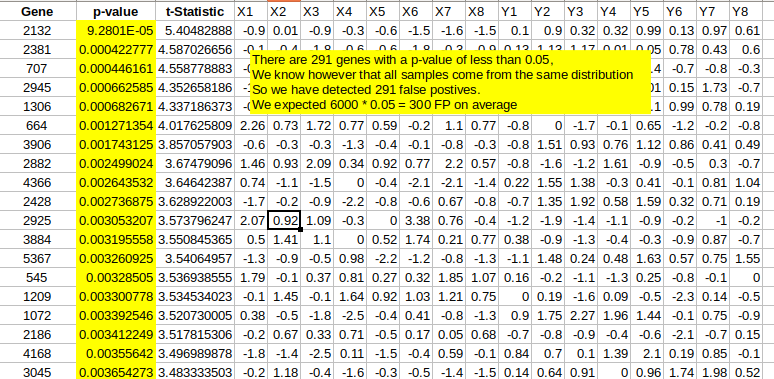
```
---

# So what can be done?

- Intuitive idea: Doing many tests increases the chances of calling false positives,

- This may be compensated 
    + Using _more restrictive error rates_, for instance 0.01 or 0.005 instead of 0.05.
    
    + Adjusting ("correcting") the p-values to compensate for the number of tests.
    
---

# Distinct Error Rates

- Individual error rate (IER)
    + Error rate of a single test.
    + For a test with 5% significance level the IER is 0.05
    
- Global Error Rate
    + Error rate for one or several groups of tests. 
    + For a group of tests each with 5% significance the global error rate is > 5%

---

<!-- # Extending type I error control -->

<!-- - With more than 1 test rejecting hypotheses with a p-value less than $\alpha$ doesn’t control for $P[FD]$ anymore. -->
<!-- - What can be done? -->
<!--      + Extend the idea of type I error -->
<!--           - FWER and FDR are two such extensions -->

<!--      + Look for procedures that control the probability for these extended error types -->
<!--           - Mainly adjust raw p-values -->

<!-- --- -->


# Decision table for many tests

- With many tests we count discoveries 

```{r echo=FALSE, out.width="100%", fig.align='center'}
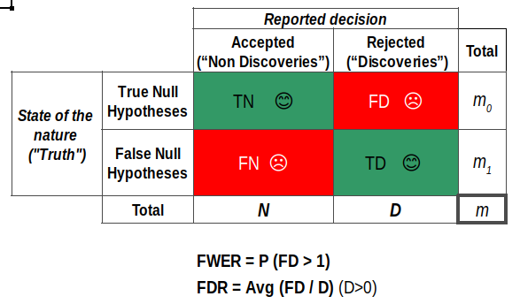
```

---

# Two main error rate extensions

- Family Wise Error Rate (FWER) 
    + FWER is probability of at least 1 False Discovery
    + FWER = P (FD > 0) 
   
- False Discovery Rate (FDR)
    + FDR is expected value of proportion of False Discoveries among all Discoveries .
    + FDR = E (FD/D; D>0)
---

# FWER / FDR control procedures

- FWER 
    + Bonferroni
    + Holm (1979)
    + Hochberg (1986)

- FDR
    + Benjamini & Hochberg (1995)
    + Benjamini & Yekutieli (2001)
---

# Controlling the FWER (Bonferroni)

- Bonferroni procedure: Adjust significance level for number of tests performed (m)

  + Use significance level $\alpha/m$, 

- Equivalently, adjust p-values multiplying all p-values by m.

- Other, more efficient procedures available: See a statistician

---

# Example. Presenting data.

.pull-left[
.font70[

- García-Arenzana et al. (2014) tested associations of 25 dietary variables with mammographic density, an important risk factor for breast cancer, in Spanish women.
- They found the following results (only first 10 are shown)
]
]
.pull-right[
```{r echo=FALSE, out.width="100%", fig.align='center'}
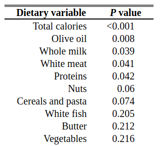
```
]

[See complete example](http://www.biostathandbook.com/multiplecomparisons.html)

---

# Example. Bonferroni (FWER)

```{r echo=FALSE, out.width="100%", fig.align='center'}
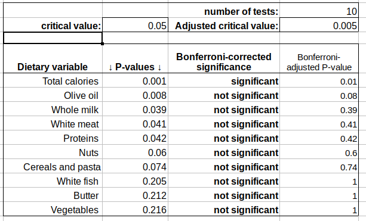
```
---


# Controlling the FDR (B & H)

- Benjamini-Hochberg procedure: Provides control of FDR for a fixed FDR value 
    + 5% FDR: On average, 5% of your significant findings will be false
    
- Important: FDR is not an individual error rate.
    + A number higher than 0.05, such as 0.10 or 0.25 can be used

---

# Benjamini & Hochberg
    
- Procedure is relatively simple
    + Order the p-values
    + To provide control at a $Q$ FDR value compare i-th smallest p-value to  $i \times Q/m$

- Instead of setting the FDR at a fixed value and establishing significance/non significance an, __adjusted p-value__ may be computed.

---

# Example. B-H (FDR)

```{r echo=FALSE, out.width="100%", fig.align='center'}
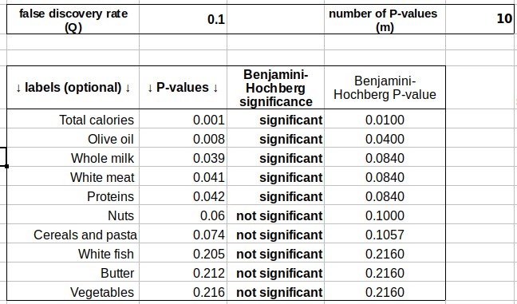
```
---


# What error rate to control for

- FWER Controls for no (0) false positives
     + Rejects many fewer hypothese (less false positives),
     + but you are likely to miss many.
     + Adequate if goal is to identify few cases that differ between two groups.
     
---

# What error rate to control for

- FDR Controls the (expected) proportion of false positives
    + if you can tolerate more false positives
    + you will get many fewer false negatives
    + Adequate if goal is to pursue the study e.g. to determine functional relationships among genes


---

# Philosophical issues: To adjust or not.

- Differing opinions on whether or when adjustment is needed
- Choice of family of hypotheses to adjust for is arbitrary, and results are very sensitive to this choice
    + Choose small, more focused families, specified a priori (in writing) to avoid cheating.
- Increase in type II errors due to adjustment (loss of power or ability to detect real differences)
    + Use an appropriate and powerful testing procedure (see yor bedside statistician).
- Argue for unadjusted analysis if required, but with full disclosure of data analysis procedures
    + Difficult for reviewers to evaluate.
    
---
# Philosophical issues: To adjust or not.

- Need for adjustment, and best method of adjustment, is often scenario dependent
- Things to consider (Westfall et al., 1999)
    + Is it plausible that many of the null hypotheses might be true?
    + Do you want to ensure reproducibility, or be able to claim that an identified significant finding is in fact real?
    + Do you want to heavily mine the data to find a “significant” result?
    + Is your study expensive and unlikely to be repeated before serious actions are taken?
    + Is there an important cost associated with type I errors?

---

# References

---

# QUESTIONS?

```{r echo=FALSE, out.width="90%", fig.align='center'}
knitr::include_graphics("images/questions.png")
```


```{r, warning = FALSE, comment = NA, message = FALSE, echo = FALSE, eval = FALSE}
# HTML to PDF
library(webshot)
file_name <- paste0("file://", normalizePath("Multiple_Testing.html"))
webshot(file_name, "Multiple_Testing.pdf")
```

